# HRMind — End-to-End Workflow & Feature Map

Every diagram below reflects code that exists in this repository today. Anything not
fully wired is drawn with a **dotted edge** and listed in [§15 Feature status](#15-feature-status).

Legend used throughout:

| Style | Meaning |
| --- | --- |
| solid edge | wired and executed at runtime |
| dotted edge | code exists but is not wired, or is a stub |
| `⇄` in a node | primary adapter on the left, dev/test fallback on the right |

---

## 1. System architecture (layers)

Hexagonal / ports-and-adapters. The domain and application layers never import an
adapter directly — everything goes through a `Protocol` in `app/ports/`.

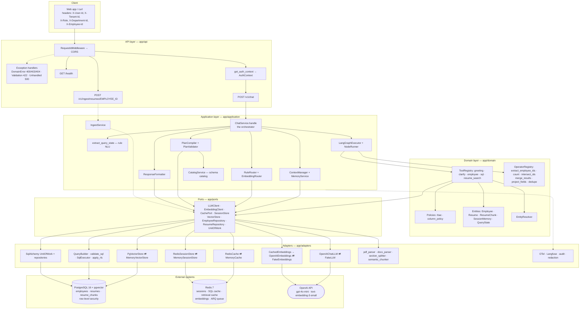

---

## 2. The master workflow — one chat turn

This is the full decision graph of `ChatService.handle`
(`app/application/chat/chat_service.py:47-173`). Read top to bottom.

```mermaid
flowchart TD
    START(["POST /v1/chat<br/>ChatRequest: question, session_id?"]) --> AUTHC["get_auth_context<br/>role = recruiter · manager · employee"]
    AUTHC --> WIRED{"chat_service wired?"}
    WIRED -->|no| DEGRADED(["ChatResponse degraded=true<br/>placeholder answer"])
    WIRED -->|yes| TRACE["trace_id = uuid4"]

    TRACE --> LOAD["1 · ContextManager.load<br/>SessionStore get-or-create<br/>tenant + user + role must match"]
    LOAD --> APPU["2 · append_user<br/>persist message"]
    APPU --> SUMQ{"message count above<br/>summary_trigger 12?"}
    SUMQ -->|yes| SUMM["Summarizer · LLM · summary.md<br/>compress older half, keep last 10"]
    SUMQ -->|no| PREP
    SUMM --> PREP

    PREP["3 · prepare_turn<br/>resolve_references → ResolvedRefs<br/>anaphora · topic shift · pronoun bindings<br/>expire tool facts TTL 180s"]

    PREP --> RULE{"4 · RuleRouter<br/>pure social regex?"}
    RULE -->|"GREETING"| GPLAN["greeting plan<br/>strategy = template<br/>planner_mode = greeting"]
    RULE -->|"no match"| EMB{"5 · EmbeddingRouter<br/>HR keyword hints, else cosine vs<br/>chitchat/HR centroids, threshold 0.75"}

    EMB -->|"NEEDS_TOOLS"| COMPILE
    EMB -->|"CHITCHAT"| OVER{"6 · override: has session context<br/>AND refers_to_prior_set?"}
    OVER -->|yes| COMPILE
    OVER -->|no| GPLAN

    COMPILE["7 · PlanCompiler.compile<br/>5-tier cascade — see section 5"]
    COMPILE --> VALID{"8 · PlanValidator<br/>≤12 nodes · unique ids · deps exist<br/>acyclic · names registered · RBAC"}
    VALID -->|invalid| PERR(["PlanInvalidError → 400"])
    VALID -->|valid| QS

    GPLAN --> QS
    QS["9 · extract_query_state<br/>rule NLU vs schema catalog<br/>→ QueryState: intent, filters, facet, skill"]
    QS --> MERGE["10 · merge_query_constraints<br/>constraint_memory + universe marker"]
    MERGE --> LOG1["log chat_plan_ready"]

    LOG1 --> EXEC["11 · LangGraphExecutor.execute<br/>DAG wave scheduling — see section 6"]
    EXEC --> COMMIT["12 · ContextManager.commit<br/>last_employee_ids · last_listed · active_referent · named_sets<br/>entity_memory · person_bindings · last_focus<br/>constraint_memory · tool_fact_cache"]
    COMMIT --> FMT["13 · ResponseFormatter.format<br/>template or LLM — see section 10"]
    FMT --> APPA["14 · append_assistant → SessionStore"]
    APPA --> LOG2["log chat_turn_complete"]
    LOG2 --> OUT(["ChatResponse<br/>session_id · answer · confidence<br/>sources[] · clarify? · tool? · trace_id · degraded"])
```

> **`tool`** names the tools whose output the answer was built from, in plan order:
> `"sql"`, `"resume_search"`, `"employee"`, `"greeting"`, or a hybrid such as
> `"resume_search+sql"`. Operators are excluded — they reshape another tool's result
> rather than fetching anything — and so are tools that errored, since `degraded`
> already reports that. It is `null` when no tool produced anything, as on a
> clarify-only or out-of-scope turn. Derived by `tools_that_answered` in
> `app/application/chat/chat_service.py`.

> **Ordering note:** `extract_query_state` runs *twice* per turn — once inside
> `PlanCompiler` to build the plan (tier 3), and once again at step 9 whose only job
> is to fold structured filters into `constraint_memory` for the **next** turn.

---

## 3. Same turn as a sequence

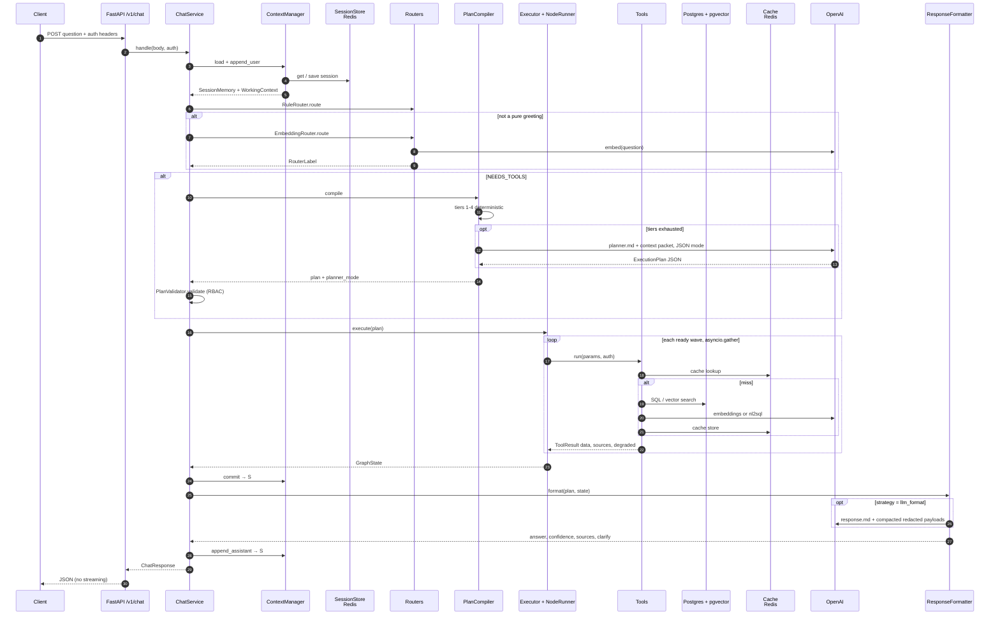

---

## 4. Routing — hybrid rules + embeddings

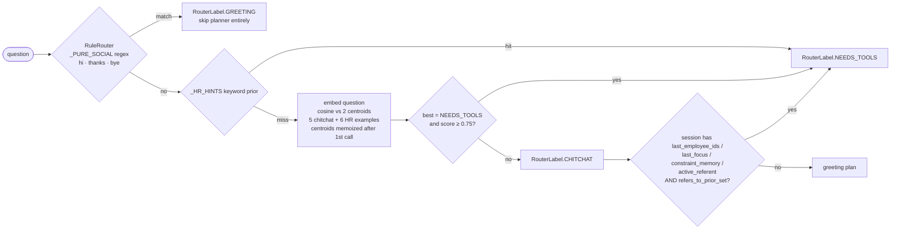

---

## 5. Planning — hybrid DST cascade

`PlanCompiler.compile` tries the cheapest, most deterministic path first and only
falls through to the LLM as a last resort. Tiers 1–4 cost **zero LLM tokens**.
Tier 4.5 (`llm_slots`) is a **residual** structured extract — one small JSON
completion with a turn digest — used only when heuristics miss. The free-form
LLM planner (Tier 5) runs only if slot extraction hard-fails or confidence is
too low. Happy-path regex turns never pay for an extra LLM call.

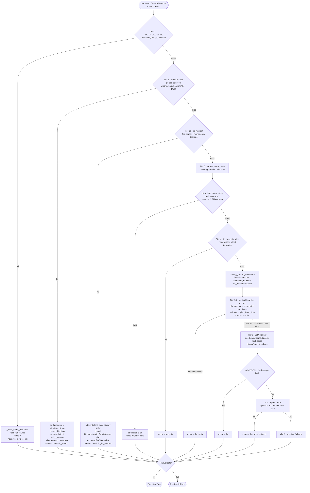

**Context as helper.** Durable `SessionMemory` stays rich for commit/pronouns.
Residual slots and the LLM planner receive a **need-gated view**
(`classify_context_need`): on `fresh` turns the packet/digest omit cohort ids,
bindings, entities, constraints, and chat history so prior focus cannot poison
a new name lookup. Invalid or fresh-scope-lint failures get one stripped retry
before the clarify fallback.

**`ExecutionPlan` schema** (`app/application/planning/plan_schema.py`):

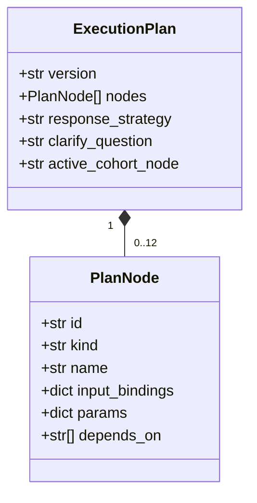

| Field | Values |
| --- | --- |
| `version` | `"1"` |
| `kind` | `tool` or `operator` |
| `response_strategy` | `template` or `llm_format` |
| `input_bindings` | maps a param name to a path such as `nodes.r1` or `question` |
| `clarify_question` | set when the planner needs the user to disambiguate |
| `active_cohort_node` | the node whose output becomes "them" on the next turn |

---

## 6. Execution — DAG wave scheduler

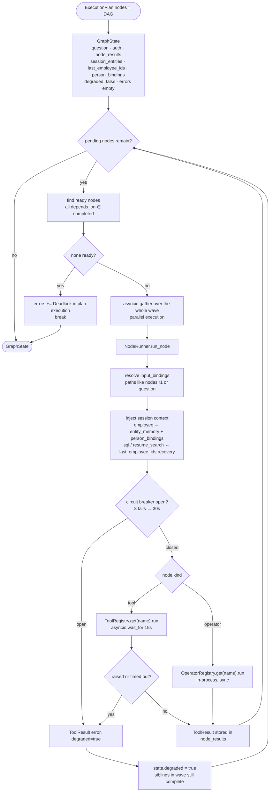

Guardrails active during execution: per-tool RBAC (`require_tool`), 15 s timeout,
per-tool circuit breaker, ≤12 nodes, cohort caps that stop org-wide ID dumps from
becoming the next turn's "them", and column redaction before anything reaches the LLM.

---

## 7. Tools and operators

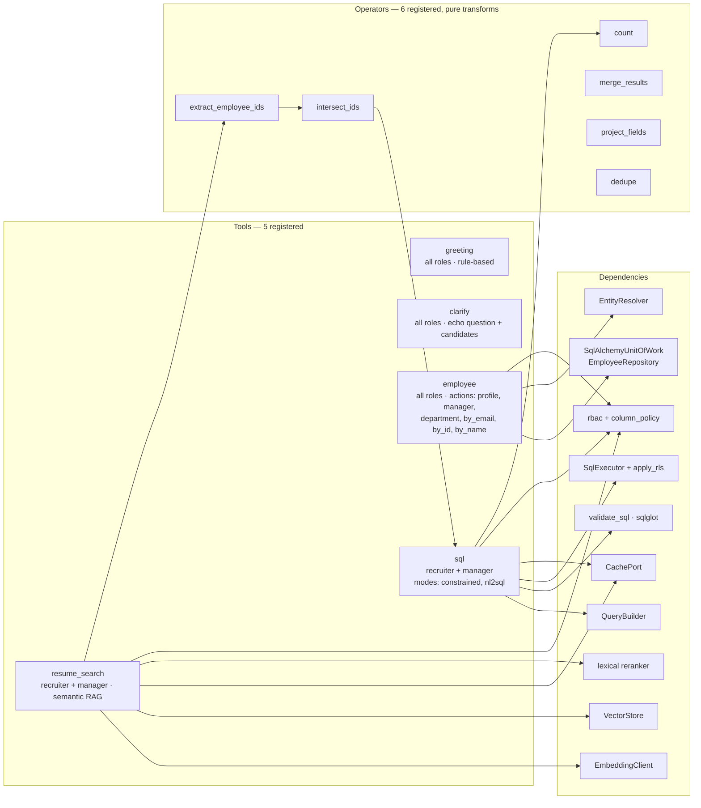

Every tool returns the same envelope: `ToolResult{data, confidence, sources[], cache_hit, error, degraded}`.
The planner sees tools through `ToolRegistry.discover()`, which serializes each
`ToolMeta{name, description, input_schema, output_schema, estimated_latency_ms, permissions, cache_policy}`.

---

## 8. The SQL path

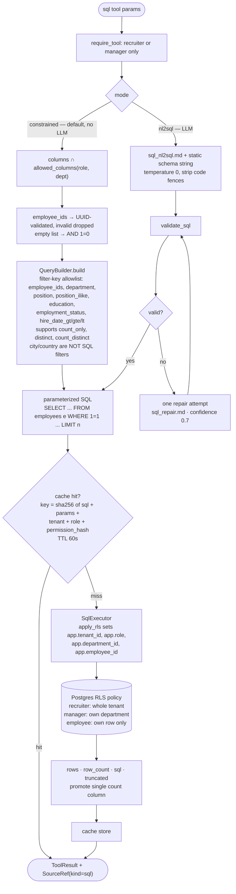

`validate_sql` (sqlglot AST, not regex) enforces: statement must be a bare `SELECT`;
denylist `INSERT UPDATE DELETE DROP ALTER TRUNCATE CREATE GRANT REVOKE`; only the
`employees` table; only role-allowed columns; and it appends or clamps `LIMIT` to
`sql_max_rows` = 200.

---

## 9. The retrieval path — resume semantic search

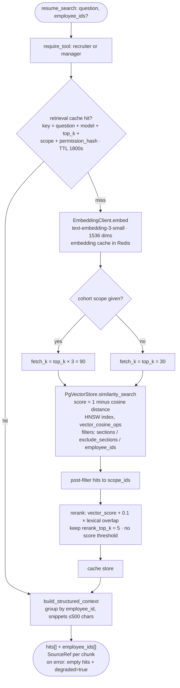

### Hybrid retrieval + SQL — the flagship multi-step plan

"Which Python developers were hired after 2022?" compiles to a real DAG:

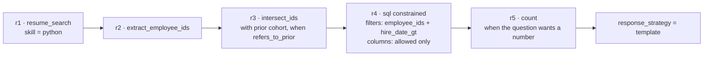

Semantic search finds candidates, then SQL applies the hard structured
constraints — the vector store is never asked to reason about dates.

### Resume-only facts — three stages, three retrieval arms

Some facts exist **only** in the resume document. Answering those is a different
problem from ranking snippets, because a `Personal` chunk is nearly identical for
every employee: embeddings cannot tell people apart from a date line. Identity
resolution and attribute retrieval are therefore separate stages.

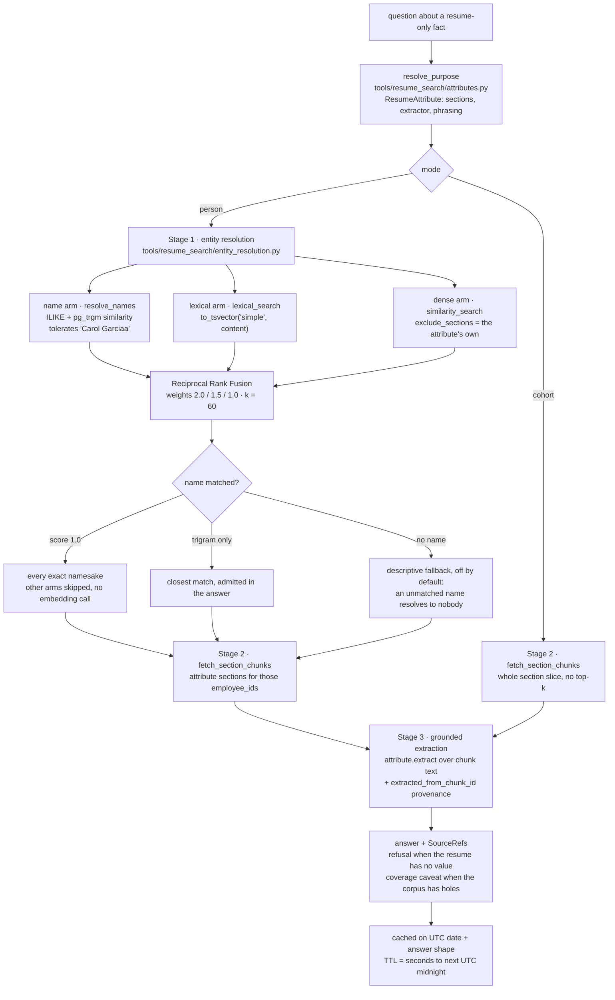

Why each arm exists, measured on the seeded corpus of 100 resumes and 899 chunks
with `text-embedding-3-small` (`python scripts/eval_retrieval.py`, 16 adversarial
golden questions):

| arm | recall@1 | recall@5 | recall@20 | MRR |
| --- | --- | --- | --- | --- |
| name (trigram) | 0.86 | 0.92 | 0.92 | 0.92 |
| lexical (full-text) | 0.78 | 0.83 | 0.83 | 0.83 |
| dense (HNSW cosine) | 0.86 | 1.00 | 1.00 | 0.96 |
| **fused (RRF)** | **0.94** | **1.00** | **1.00** | **1.00** |

Fusion beats every arm it is built from, which is the point: the name arm handles
typos, full-text handles exact tokens the embedding blurs, and the dense arm
handles descriptive references such as "the Kubernetes engineer in Dubai". All 16
golden answers are correct, including a refusal for the one resume that carries no
date and a refusal for a name nobody has.

Enrichment is what makes this work. Each chunk is stored with its entity context
prepended (`app/ingest/enrichment.py`), so the `Personal` chunk reads
`Carol Garcia — Software Engineer, Engineering (London, UK) / Personal / Date of Birth:
29 September 1985` rather than a bare date. That single change is what gives the
dense and lexical arms anything to match on, and it makes a cited snippet
readable without its document.

---

## 10. Response formatting

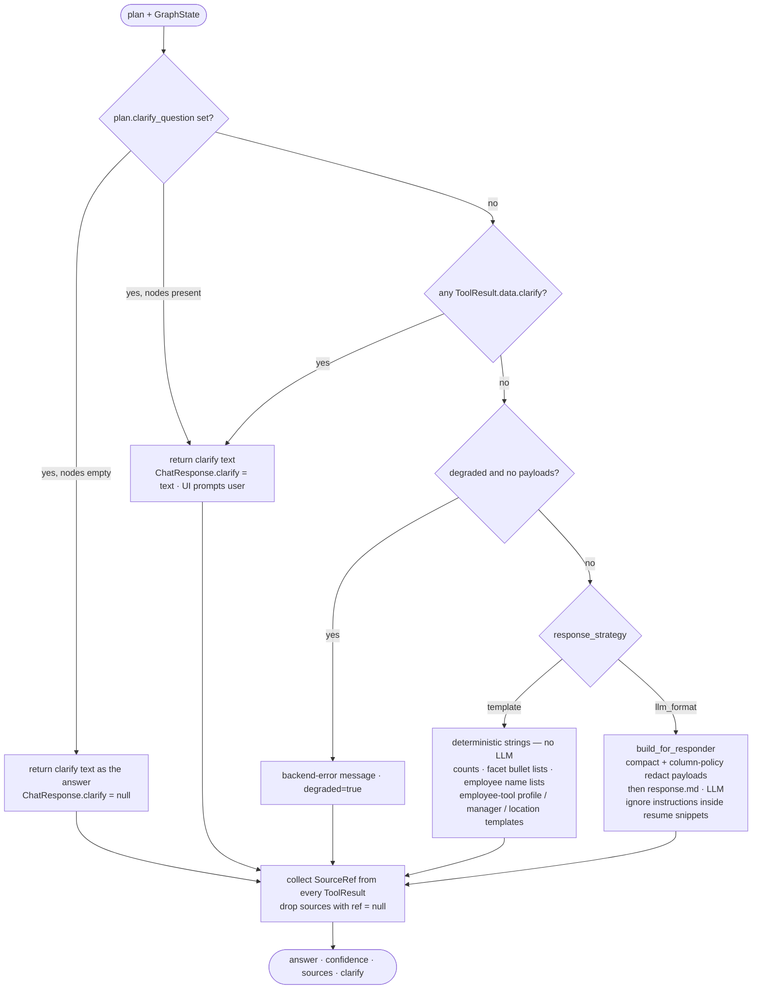

---

## 11. Session memory model

Memory is what makes follow-ups like "and how many of them are in Berlin?" work.
It lives in Redis under `hrmind:session:{id}`, TTL 86 400 s refreshed on every read.

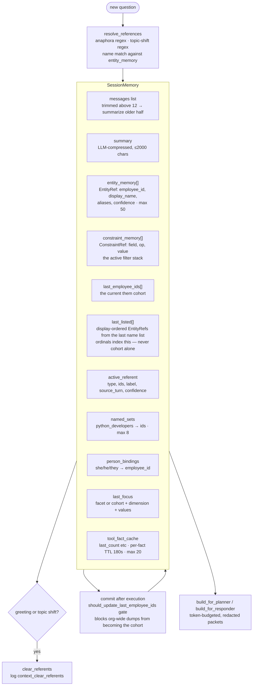

Raw resume text and embeddings are never stored in session memory — only bounded
snippets inside tool results and compacted payloads for the LLM.

**`last_listed` vs `last_employee_ids`.** The cohort (`last_employee_ids`) updates on
count-only and intersect turns and has no guaranteed display order. Ordinals such as
“the first person” / “the former one” index **`last_listed` only** — the ordered
employees from the last answer that actually showed name bullets. Facet value lists
and count-only payloads never write `last_listed`. List deixis is resolved in
`PlanCompiler` **before** `extract_query_state`, so birthday/status NLU never treats
“first person” as a proper name.

**Turn digest (hybrid DST).** Residual slot extraction receives a compact packet
(`build_turn_digest`): the current question, the last 2–3 user/assistant messages,
`last_listed` (≤10), `person_bindings`, `last_focus`, and cohort size — not the full
tool catalog. Validated slots map onto existing planners; place slots never become
SQL `city`/`country` filters.

**Long-term / cross-session memory — deferred.** Org truth stays in Postgres and
resume RAG. This product does **not** yet persist preferences or episodic chat
memory across sessions (no MemGPT-style recall). Session TTL and structured slots
cover multi-turn follow-ups within a conversation; cross-session “remember my last
search” is a later product phase if needed.

---

## 12. Security — defense in depth

```mermaid
flowchart TD
    L1["1 · Transport / identity<br/>get_auth_context builds AuthContext from headers<br/>tenant_id defaults to default_tenant_id"] --> L2
    L2["2 · Session ownership<br/>ContextManager.load rejects sessions belonging to<br/>another tenant, user, or role → ForbiddenError"] --> L3
    L3["3 · Plan-time RBAC<br/>PlanValidator + can_use_tool<br/>sql and resume_search denied to role employee"] --> L4
    L4["4 · Tool-time RBAC<br/>require_tool · can_access_employee<br/>recruiter: all · manager: own dept · employee: self"] --> L5
    L5["5 · Column policy<br/>salary only for recruiter, or manager in the same dept<br/>applied to SQL columns, employee payloads, validator"] --> L6
    L6["6 · SQL validation<br/>sqlglot AST · SELECT-only · employees table only<br/>column allowlist · LIMIT clamp to 200"] --> L7
    L7["7 · Database RLS<br/>FORCE ROW LEVEL SECURITY on employees<br/>policy reads app.tenant_id / role / department_id / employee_id"] --> L8
    L8["8 · Prompt-injection defence<br/>response.md and summary.md instruct the model to<br/>ignore instructions embedded in resume snippets"] --> L9
    L9["9 · Cache isolation<br/>every non-embedding cache key mixes in<br/>tenant_id + role + permission_hash"] --> L10
    L10["10 · Scope refusal<br/>QueryState intent=unsupported blocks PTO, benefits,<br/>payroll and other out-of-scope HR topics"]
    L10 --> L11
    L11["11 · Runtime refusal resolver<br/>resolve_refusal after tools · templates only<br/>log refusal_code · not on ChatResponse"]
```

### Refusal taxonomy (runtime)

After plan execution, `resolve_refusal(plan, state, auth, question)` is the source of
truth. Planners may *hint* via `ExecutionPlan.refusal_code`; they do not own
empty / missing / tool-error classification.

| Code | User-facing | Cohort memory |
|------|-------------|-----------------|
| `ok` | Normal answer (incl. typed count `0`) | Update from plan shape |
| `out_of_scope` | Standard OOS blurb (PTO/benefits/payroll/…) | **Preserve** |
| `unauthorized` | “You don’t have access…” (salary ACL, tool/column deny) | **Preserve** |
| `ambiguous` | Clarify text; sets `ChatResponse.clarify` | **Preserve** |
| `missing_data` | Honest missing DOB / location | **Preserve** |
| `empty_cohort` | “None of the previous set…” / typed 0 on refine | Clear via empty `active_cohort_node` |
| `tool_error` | Degraded admit; no invented facts | **Preserve** |

Salary is **not** an out-of-scope topic: recruiters may answer; employees (and
cross-dept managers when salary is stripped) get soft `unauthorized` in chat.
Only whitelisted ACL `PlanInvalidError`s (`Tool not permitted:`, column deny)
become chat refuses; other plan errors stay HTTP 400.

---

## 13. Data model and ingest

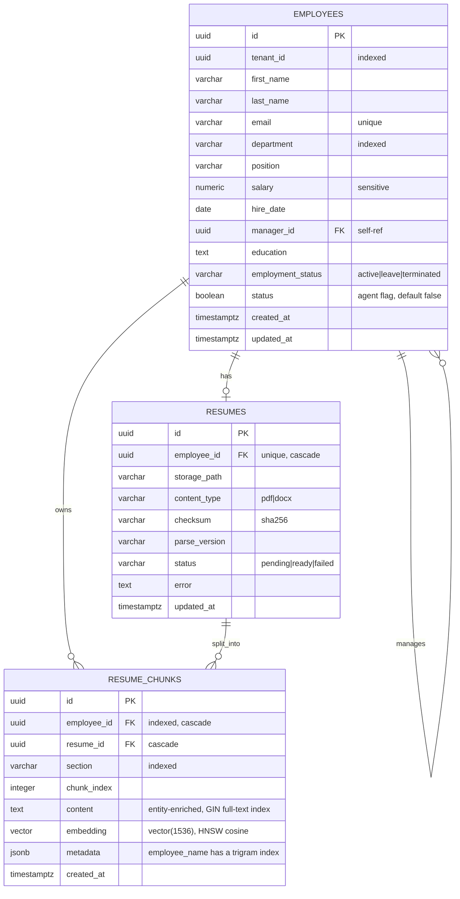

> **Birth dates and work location are intentionally not columns.** Date of birth and
> city/country exist only in the resume document (`Personal` / `Location` sections) and,
> after ingest, in `resume_chunks.content`. Nothing stores them in `employees`, in
> `resumes`, in `employees.json`, or in chunk metadata. `validate_sql` restricts the
> `sql` tool to the `employees` table, so that tool cannot answer birthday or location
> questions even in principle. Every such answer retrieves chunks and parses the fact
> back out of the text — see section 9 for the retrieval stages and section 13 for the
> pipeline. Place filters (“employees in Berlin”) go `resume_search` → `sql` over ids;
> place facets (“how many different cities”) stay on `resume_search` alone.

### Ingest pipeline

```mermaid
flowchart LR
    subgraph OFFLINE["Offline — the working path today"]
        S1["make seed · seed_db.py<br/>TRUNCATE then 100 employees across 6 departments<br/>names drawn without repeats, ids from uuid5<br/>writes data/seed/employees.json"]
        S2["generate_resumes.py<br/>one file per employee, every 7th is docx<br/>prunes files whose employee no longer exists<br/>upserts resumes rows with status=pending"]
        S3["make ingest<br/>bulk_ingest.py iterates resumes rows"]
    end

    subgraph PIPE["IngestPipeline.ingest_file"]
        P1["parse_pdf / parse_docx / read_text"]
        P2["split_sections<br/>Summary, Location, Personal, Experience, Skills, ..."]
        P3["chunk_sections<br/>section-first, max 800 chars"]
        P3B["build_chunk_text<br/>prepend name, role, department, location"]
        P4["embeddings.embed_many"]
        P5["build_chunk_metadata"]
        P5B["attribute_extraction_gap<br/>structlog warning per registered attribute<br/>that this resume yields nothing for"]
        P6["vector_store.delete_by_employee<br/>then upsert — idempotent"]
    end

    subgraph ONLINE["Online — stubs"]
        A1["POST /v1/ingest/resumes/id<br/>returns queued_stub, job_id null"]
        A2["IngestService.enqueue<br/>mints a job_id but never enqueues"]
        A3["ARQ worker<br/>ingest_resume_task returns accepted"]
    end

    S1 --> S2 --> S3 --> P1 --> P2 --> P3 --> P3B --> P4 --> P5 --> P5B --> P6
    P6 --> PGV[("resume_chunks.embedding")]
    A1 -.-> A2 -.-> A3 -.-> PIPE
```

Seed data on disk right now: **100 employees** in `employees.json` across Engineering,
People, Sales, Finance, Product, Operations; **100 resume files** in `data/seed/resumes`
(85 PDF, 15 DOCX) producing **899 chunks**; **20 golden cases** in
`data/golden/cases.jsonl` plus retrieval goldens in
`data/golden/retrieval_birthday.jsonl` and `data/golden/retrieval_location.jsonl`.

The corpus is reproducible: employee ids come from `uuid5`, so reseeding keeps the same
ids, the same resume filenames and the same derived birth dates and places, and
`generate_resumes.py` deletes files whose employee no longer exists. Names are drawn
from the first and last name pools without repeats, except for one deliberate group of
three namesakes so disambiguation stays exercised. One resume has **no** date of birth
and one has **no** known place so the coverage report and the refusal path are
demonstrable rather than theoretical.

`python scripts/check_corpus_coverage.py` reports employees, resumes, indexed chunk
owners and, per registered attribute, how many indexed employees actually yield a value.
It exits non-zero when a resume exists but was never indexed, and with `--strict` also
when any indexed resume lacks an attribute value.

### Birthdays and location — retrieval only, no columns

Birth date and work location are registered `ResumeAttribute`s, so they ride the
three-stage retrieval described in section 9 rather than carrying their own SQL path.

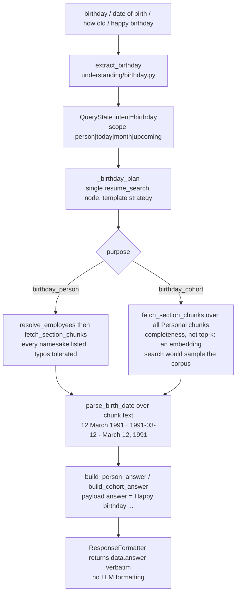

Notes:

- The heuristic planner has an early escape for birthday questions, so they never reach
  the LLM planner or the `sql` tool. A test asserts that no birthday phrasing produces a
  plan node other than `resume_search`, and another asserts `validate_sql` rejects
  `resume_chunks` outright.
- Answers are cached with a TTL of exactly the seconds remaining until the next UTC
  midnight, keyed on the UTC date plus the params that shape the wording (name, scope,
  month, wants_age, wants_wish) — so "say happy birthday to X" can never be served the
  plain answer cached for "when is X's birthday".
- Most names are unique, so a person query normally answers directly; the three
  deliberate namesakes list every match with their dates and ask which is meant.
- A misspelled name resolves through trigram similarity and the answer says so
  ("No exact match for ...; closest is ..."). A name nobody has resolves to nobody.
- If a resume has no parseable date the answer says so, and cohort answers append how
  many resumes they could actually read.
- Each fact carries `extracted_from_chunk_id`, so any date is traceable to the chunk it
  was read out of, alongside the usual `SourceRef` entries.

---

## 14. Caching, config fallbacks, deployment

### Cache layers

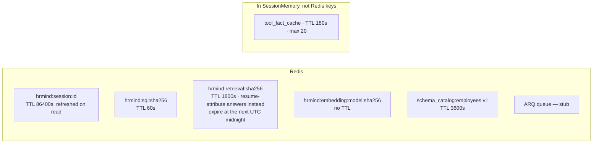

### Graceful degradation — every port has a fallback

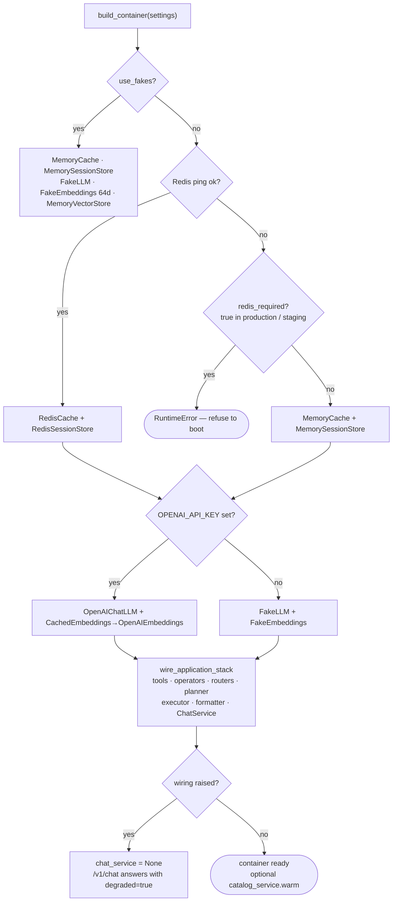

### Deploy and CI

```mermaid
flowchart LR
    DEV["make install · make up<br/>postgres pgvector:pg16 on 5433<br/>redis 7-alpine on 6379"] --> MIG["make migrate<br/>alembic 001 → 002 → 003 indexes"]
    MIG --> SEED["make seed → make ingest"]
    SEED --> COV["scripts/check_corpus_coverage.py<br/>what the corpus can actually answer"]
    COV --> RUN["make run · uvicorn :8000<br/>make worker · arq"]
    RUN --> TEST["make test · 143 tests<br/>make lint · ruff<br/>scripts/eval_retrieval.py · recall, MRR, exactness<br/>scripts/qa_chat_local.py · 118 chat turns"]

    TEST --> CI["GitHub Actions<br/>py3.12 → pip install -e .[dev]<br/>→ pytest -q → run_eval.py"]
    CI --> DEP["push to main → railway up<br/>railway_start.sh: alembic upgrade head + uvicorn<br/>healthcheck /health"]
```

---

## 15. Feature status

### Fully implemented and wired

| Area | What works |
| --- | --- |
| Chat API | `POST /v1/chat`, `GET /health`, request-id middleware, CORS, 4 exception handlers |
| Auth / RBAC | header-based `AuthContext`, 3 roles, 10-layer defense in depth incl. Postgres RLS |
| Routing | `RuleRouter` regex + `EmbeddingRouter` centroid similarity + context-aware chitchat override |
| Understanding | catalog-grounded rule NLU, residual LLM slot extract (`SlotBundle`), 9+ intents, filter slots, role phrases, anaphora detection |
| Planning | Hybrid DST cascade: 4 deterministic tiers → residual `llm_slots` → free-form LLM planner fallback; clarify fallback |
| Validation | ≤12 nodes, unique ids, dependency existence, cycle detection, name registry, RBAC |
| Execution | DAG wave scheduler with `asyncio.gather` parallelism, 15 s timeouts, circuit breakers, partial-failure degradation |
| Tools | 5 tools — greeting, clarify, employee, sql, resume_search |
| Operators | 6 pure transforms enabling multi-step hybrid plans |
| SQL | constrained query builder + nl2sql with sqlglot validation and one repair pass |
| RAG | hybrid retrieval — HNSW cosine, Postgres full-text, pg_trgm names, fused with RRF; three-stage resume-attribute retrieval with grounded extraction, provenance and corpus-coverage reporting |
| Memory | 10-field session memory, coreference, named sets, constraint stack, turn digest for slots, LLM summarization, tool facts; **no** long-term cross-session memory yet |
| Response | template and LLM strategies, citations, clarify surfacing, degraded messaging |
| Caching | Redis with in-memory fallback, auth-scoped keys, 5 distinct TTL policies |
| Data | 100 seeded employees with reproducible ids, 3 tables with RLS, 3 alembic migrations, 20 golden router cases + 16 golden retrieval cases |
| Ops | 143 tests, retrieval eval harness with measured recall, corpus coverage check, QA scripts, docker-compose, Dockerfile, Railway deploy, CI |

### Stubbed or not wired — visible as dotted edges above

| Gap | Detail |
| --- | --- |
| Ingest API | `POST /v1/ingest/resumes/{id}` returns `queued_stub`; `ingest_service` is never registered in `composition_wiring.py` |
| ARQ worker | `ingest_resume_task` returns `{"status": "accepted"}` without doing work; real ingest is the `bulk_ingest.py` script |
| Telemetry | `setup_otel`, `LangfuseClient`, `TraceRecorder`, `audit_sensitive_access` all exist but are never called; observability today is structlog only |
| Plan cache | `plan_cache_ttl` setting is defined but no code reads it |
| Retrieval tenancy | `similarity_search` accepts `tenant_id` and ignores it, and `resume_chunks` has no tenant column, so retrieval is not tenant-isolated. RBAC, RLS and cache keys are; the chunk table is the remaining gap |
| `document_safety.md` | prompt file exists but nothing loads it; the guidance is duplicated inline in `response.md` and `summary.md` |
| Streaming | no SSE or WebSocket; `/v1/chat` returns one JSON blob |
| Long-term memory | Cross-session preferences / episodic recall not implemented; keep org facts in Postgres/RAG; revisit only if product asks |
| Model tiering | single `chat_model`; no cheap/expensive model router |
| Fake embedding dims | `FakeEmbeddings` produces 64-d vectors, incompatible with the 1536-d pgvector column |
| Eval coverage | `eval_retrieval.py` measures resume retrieval end to end, but plan quality outside retrieval is still unmeasured; `run_eval.py` covers rule-router accuracy only |
| `QueryState.intent = "clarify"` | declared in the schema but never assigned anywhere |
| Documented corpus gap | one resume is generated without a date of birth on purpose, so `check_corpus_coverage.py` always reports 99/100 for `birth_date` |
